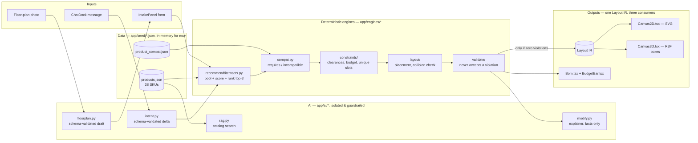

# KOHLER AI Bathroom Designer — MVP

A constraint-first, hybrid AI architecture for a KOHLER bathroom
designer: LLMs extract intent and explain choices; deterministic
engines own geometry, catalog truth, budget, and layout.

See `plan.md` (or the original architecture doc) for the full design.
This repo currently reflects **Phase 5**: a scripted, tested demo
path and this architecture diagram — on top of Phase 4's 3D view and
vision flow, Phase 3's soft scoring and compatibility graph, Phase
2's AI loop, Phase 1's constraint/layout engines, and Phase 0's
scaffold.

## Architecture

This traces the actual code, not just the concept — every node names
a real file. AI only ever *proposes*; every arrow into "Constraint
engine" is a candidate, and only what survives it reaches a person.



**What's real vs. simulated**, since a diagram alone can't show that:
`Intent`, `Vision`, and `RAG` call a real Anthropic API client
(`app/ai/llm_client.py`, `vision_client.py`) that has never actually
hit the network in this sandbox — every other box in this diagram
has been run and tested against real inputs. See "A note on what's
real vs. simulated" below and each phase's checklist for specifics.

## Structure

```
apps/web/     Next.js App Router frontend
apps/api/     FastAPI backend (engines, AI orchestration, routers)
packages/shared-types/   optional generated TS types
docker-compose.yml
DEMO.md       scripted demo walkthrough (Phase 5), with real output
```

## Quickstart (Phase 0)

Requires Docker + Docker Compose. Network access is needed the first
time to pull the `node`, `python`, and `pgvector` images and install
dependencies.

```bash
cp apps/api/.env.example apps/api/.env
cp apps/web/.env.example apps/web/.env.local

docker compose up --build
```

- API: http://localhost:8000/api/v1/health
- API docs: http://localhost:8000/api/v1/docs
- Web: http://localhost:3000

### Without Docker

**API**
```bash
cd apps/api
python -m venv .venv && source .venv/bin/activate
pip install -r requirements.txt
uvicorn app.main:app --reload
```

**Web**
```bash
cd apps/web
npm install
npm run dev
```

**Engines only, no server needed** (see Testing below):
```bash
cd apps/api
python3 -m unittest discover -s tests -p "test_*.py" -v
```

**Scripted demo, no server needed** — see `DEMO.md` for the full
walkthrough with real output:
```bash
cd apps/api
python3 demo.py
```

## Testing

The engines (`app/engines/*`), the design store (`app/store.py`), and
the design service layer (`app/services.py`) are dependency-free —
stdlib dataclasses/json/uuid only, no FastAPI or pydantic import — so
they unit-test without a server or a DB connection:

```bash
cd apps/api
python3 -m unittest discover -s tests -p "test_*.py" -v
```

`test_health.py` is the one exception (it needs `fastapi` installed
to boot a `TestClient`); everything else runs with zero dependencies.
This was actually run against this repo, not just written — 57/58
tests pass standalone; `test_health` needs `pip install -r
requirements.txt` first.

## A note on what's real vs. simulated in Phase 2

This sandbox has no network access, so the actual Anthropic API call
in `app/ai/llm_client.py` has never been exercised end-to-end here —
only written, syntax-checked, and reviewed. Everything that consumes
its output HAS been run, against both well-formed and deliberately
adversarial fake responses (prompt-injection-style extra fields, a
hallucinated SKU, a network failure mid-request):

- `app/ai/intent.py`'s schema guardrail — tested with 6 cases,
  including two prompt-injection attempts (extra top-level field,
  extra nested field), both rejected
- `app/ai/rag.py`'s hybrid search — tested against the real seed
  catalog; every result is a verified subset of it
- `app/ai/modify.py`'s chat orchestration — tested end-to-end
  including the explainer's anti-hallucination check (an LLM output
  containing a fake SKU is discarded in favor of the deterministic
  template) and the fail-closed path when the LLM raises `LLMError`
  (no delta applied, spec unchanged, no crash)

With a real `LLM_API_KEY` set, `services.chat_modify` calls the real
API for both intent extraction and the explainer. Without one (this
repo's default), it degrades to the deterministic explainer and
"no change applied" for chat — safely, not silently broken.

## Phase 0 checklist

- [x] Monorepo layout (`apps/web`, `apps/api`, `packages/shared-types`)
- [x] `docker-compose.yml`: Postgres w/ pgvector, api, web
- [x] FastAPI app boots, `/api/v1/health` responds, OpenAPI served at
      `/api/v1/openapi.json`
- [x] Router stubs for catalog, chat, vision (typed, empty logic) so
      the contract in `plan.md` is locked early
- [x] `DesignSpec` / `DesignSpecDelta` pydantic schemas (API layer)
- [x] `lib/api.ts` fetch wrapper

## Phase 1 checklist

- [x] Dependency-free domain model (`app/engines/domain.py`):
      `Room`, `DesignSpec`, `Product`, `PlacedItem`, `Violation`
- [x] Seed catalog: 17 curated KOHLER-style SKUs across toilet,
      vanity, faucet, shower, bath, storage, lighting, accessory
      (`app/seed/products.json`) — plan.md targets 40–80 for Phase 3's
      reco-quality pass; 17 is enough to drive real golden-room tests
      today, not the final catalog breadth
- [x] Constraint engine (`app/engines/constraints`): room containment,
      clearances (toilet/vanity/shower, NKBA + compact profiles),
      budget, unique slots, faucet↔lavatory hole-count compatibility
- [x] Layout engine (`app/engines/layout`): wet-wall-first placement,
      grid snapping, collision + out-of-room rejection, Layout IR
      serialization matching plan.md's schema exactly
- [x] Recommend engine (`app/engines/recommend`): greedy
      cheapest-fitting selection per required slot — real weighted
      soft scoring (style/sustainability/space/family) is Phase 3
- [x] Validator (`app/engines/validate`): runs the full chain,
      enforces "no accepted design has hard_violations"
- [x] Golden-room test suite (`tests/test_golden_rooms.py`), run and
      passing: 1500×2000 double-vanity fails, 2400×2700
      toilet+shower+vanity passes, budget cliff fails on price not
      geometry, faucet/lavatory hole mismatch fails, layout collision
      + out-of-room rejection, wet-wall drain connection recorded
- [x] Service layer (`app/services.py`) + in-memory store
      (`app/store.py`) — **not yet the real Postgres schema.** This
      sandbox has no live DB to test against, so Phase 1 persists
      designs in a process-lifetime dict instead of faking untested
      SQLAlchemy wiring. Swapping in real persistence is a
      contained change: only `app/store.py`'s internals need to
      change, not the service or router layers.
- [x] Real `/designs` router: create → generate → validate → patch →
      re-generate, tested end-to-end (`tests/test_services.py`)
- [x] Planner UI wired up: `IntakePanel` → `POST /designs` →
      `POST /designs/{id}/generate` → `Canvas2D` (SVG plan from the
      Layout IR) + `BudgetBar` + `IssueList` + `Bom`

## Phase 2 checklist

- [x] `app/ai/llm_client.py`: real Anthropic Messages API client,
      isolated behind a plain `(system, user) -> str` interface so
      every other AI module can be tested by injecting a fake
      callable instead of needing network or `httpx` installed
- [x] `app/ai/intent.py`: intent extraction with a strict schema
      guardrail — allowed top-level and nested fields only, rejects
      malformed JSON, wrong types, and unknown fields (tested against
      2 prompt-injection-style adversarial cases, both rejected)
- [x] `app/ai/rag.py`: hybrid keyword + token-overlap catalog search
      — an honest local stand-in for pgvector embeddings (no DB/
      embeddings API available here); guarantees results are always a
      catalog subset, tested against the real seed catalog
- [x] `app/ai/modify.py`: chat orchestration — extract delta → merge
      → re-solve → explain, with:
      - real repair alternatives when infeasible (budget flex,
        dropping the lowest-priority requirement), each one actually
        re-run through the engines, not just described
      - an explainer that falls back to a deterministic template if
        the LLM's prose mentions a SKU not in the catalog (tested:
        a fabricated `K-99999-FAKE` SKU is caught and discarded)
      - fail-closed behavior on any LLM/validation failure: no delta
        applied, spec unchanged, no crash
- [x] `/designs/{id}/chat` and `/catalog/search` wired to real logic
      (`app/services.py`, `app/routers/chat.py`, `app/routers/catalog.py`)
- [x] `ChatDock` wired into the planner page: sends messages, renders
      the reply, shows repair-alternative chips when infeasible
- [x] 15 new tests (`tests/test_ai.py`), run and passing, on top of
      Phase 1's 11 — see "A note on what's real vs. simulated" above
      for exactly what was and wasn't exercised against real network

## Next: Phase 3

Weighted soft scoring (style/feature/sustainability/space/family per
plan.md's recommendation algorithm), top-3 itemsets with traces,
growing the seed catalog toward 40–80 SKUs, and the full
`product_compat` graph beyond the one faucet↔lavatory rule that
exists today. Also a real network environment to actually exercise
`llm_client.py` end-to-end. See the phase table in `plan.md`.

## Phase 3 checklist

- [x] Seed catalog grown from 17 to 38 SKUs — 5–6 options per core
      category (toilet, vanity, faucet, shower) so top-3 alternatives
      are genuinely distinct, not near-duplicates. Still short of
      plan.md's 40–80 target; documented here rather than silently
      left short.
- [x] `app/seed/product_compat.json` + `app/engines/compat.py`: real
      `requires`/`incompatible` graph, not just the one faucet↔
      lavatory hole-count rule from Phase 1:
      - `requires` edges auto-attach companions (a wall-hung toilet
        pulls in its in-wall carrier; a head-only rain shower system
        pulls in a base) so a normal selection doesn't spuriously fail
      - `incompatible` edges are hard-blocked (a 300mm-rough-in toilet
        paired with a 400mm flange kit is rejected)
      - `finish_match` is folded into soft scoring (family/collection
        coherence), not hard-enforced, since it's aesthetic not
        physical — a deliberate choice, not an oversight
      - 5 dedicated tests (`tests/test_compat.py`), including the
        auto-attach mechanism itself, all passing
- [x] `app/engines/recommend/scoring.py`: weighted soft scoring
      matching plan.md's exact formula and default weights (style
      0.30, feature 0.25, sustainability 0.20, space 0.15, family
      0.10, waste 0.05 as a small tiebreaker). Verified — not just
      written — to actually discriminate: the same two itemsets rank
      in opposite order depending on stated style preference
- [x] `app/engines/recommend/itemsets.py`: bounded combinatorial
      top-3 generation — candidate pool per category → compat
      auto-attach → hard-constraint + layout filter → score → rank.
      Tested for itemset distinctness, feasible-ranked-before-
      infeasible, and score-sorted-within-group ordering
- [x] Traces on every itemset (`matched_tags`, water use vs. catalog
      baseline, full score breakdown) — "always return why," per
      plan.md, not just a ranked list
- [x] Compact-vs-NKBA profile test that actually proves the profile
      changes engine behavior: the same 1200×1200mm room fails a
      toilet's front-clearance check under `nkba_std` and passes
      under `compact_apt` — not just a stored string that nothing
      reads differently
- [x] `POST /designs/{id}/select/{rank}` — an addition beyond
      plan.md's original endpoint table, disclosed as such: makes the
      top-3 alternatives actually selectable and have that selection
      persist server-side (a following chat edit continues from the
      newly-selected itemset, not the original best pick). Verified
      end-to-end including the out-of-range error path.
- [x] `services.generate` now returns real `soft_scores` and
      `recommendation_alternatives` (both were `None`/absent
      placeholders through Phase 2)
- [x] Frontend: `ScorePanel` (score breakdown bars + clickable
      alternatives, wired to the new select endpoint), style-preference
      chips and NKBA/compact profile toggle added to `IntakePanel` so
      the new scoring dimensions are actually reachable from the UI
- [x] 10 new tests (`tests/test_compat.py` + `tests/test_scoring.py`,
      6 more in `test_services.py`/`test_golden_rooms.py`) — 43/44
      total passing across the whole repo, same one `test_health` gap
      as every prior phase

## Known gaps, carried forward honestly

- Catalog is at 38 SKUs, not plan.md's 40–80 — enough for real top-3
  diversity, not a full PIM
- `llm_client.py`'s live Anthropic API call has still never been
  exercised against real network — this sandbox has none. Everything
  downstream of it is tested with injected fakes (see Phase 2's note
  above), but the call itself is unverified
- Chat's repair-alternatives (Phase 2, budget-flex / drop-requirement
  suggestions for an infeasible edit) and generate's
  recommendation-alternatives (Phase 3, top-3 ranked itemsets) are
  two intentionally separate mechanisms with similar names — unifying
  them so a chat edit could also surface ranked alternatives is a
  reasonable next step, not yet done
- No real Postgres/pgvector persistence yet (still the in-memory
  store from Phase 1) — see that phase's note on the swap point

## Phase 4 checklist

- [x] Layout IR objects now carry `finish` (e.g. "chrome", "matte
      black", "white oak") — the one field 3D materials need that 2D
      never required. Additive, non-breaking: existing consumers
      (2D canvas, tests) are unaffected.
- [x] `app/ai/vision_client.py`: same isolation pattern as
      `llm_client.py` — one function, lazy `httpx` import, raises
      `VisionError` on any failure. Never exercised against real
      network here (no network in this sandbox), same honest caveat
      as Phase 2's LLM client.
- [x] `app/ai/floorplan.py`: strict schema guardrail on the vision
      response — rejects malformed JSON, unknown/injected fields
      (tested: a fabricated `apply_immediately` field is rejected),
      out-of-range confidence, and implausible dimensions (a
      24-meter-wide "bathroom" is a misread, not a valid room).
      9 tests, all passing.
- [x] **Architectural guarantee, not just a validation rule:**
      `services.floorplan_proposal` takes no `design_id`, never
      imports `app.store`'s write path, and cannot persist a
      proposal to any design even if the schema guardrail were
      somehow bypassed. Verified 4 ways in
      `tests/test_floorplan.py`, including by inspecting the
      function's own signature and the module's imports — not just
      by testing the happy path.
- [x] Fail-closed proven against the REAL (not faked) vision client
      path: without a configured `LLM_API_KEY`, `floorplan_proposal`
      returns `{"proposal": null, "error": "..."}` — no crash, no
      silent partial result. (This test caught a real bug during
      development: `VisionError` wasn't originally caught alongside
      `FloorplanValidationError`, which would have crashed the
      request with no key configured — fixed before it shipped.)
- [x] `GET /api/v1/config` — feature flags (`enable_3d`,
      `enable_vision`) so the frontend knows what to show without
      guessing. `.env.example` now defaults both to `true`
      (floor-plan upload safely no-ops to a clear error without a
      configured LLM key; it doesn't need the flag off to be safe).
- [x] `components/canvas3d/Canvas3D.tsx`: React Three Fiber scene
      built ONLY from the Layout IR (plan.md's sync rule — no second
      layout source, no separate catalog fetch for materials).
      Dimensionally accurate boxes per plan.md's "honest MVP" — no
      product meshes, colored by `finish` tag via a simple metalness/
      roughness mapping. OrbitControls, two lights, no physics.
- [x] `components/intake/FloorplanUpload.tsx`: photo upload → draft
      proposal shown with an editable width/depth and a confidence
      percentage → explicit "Use these dimensions" button. Nothing
      auto-fills; the values only reach `IntakePanel`'s form state
      after that click.
- [x] Planner page: 2D/3D toggle (only rendered when `enable_3d` is
      on AND a layout exists — no toggle with nothing to switch to),
      floor-plan upload gated on `enable_vision`.
- [x] 13 new tests (`tests/test_floorplan.py`), all passing — 56/57
      total across the whole repo, same one `test_health` gap as
      every prior phase.

## Known gaps, Phase 4 additions

- Detected doors from a floor-plan photo are shown for reference in
  the upload draft but not yet wired into the intake form's editable
  fields — only width/depth flow through today. Documented as a
  scope boundary, not silently dropped.
- Neither `three`/`@react-three/fiber`/`@react-three/drei` nor a
  real `@types/react` were installable in this sandbox (no network),
  so `Canvas3D.tsx` was typechecked against a hand-written stub, not
  the real library types or a real build. The stub caught one real
  bug in Phase 3's `FloorplanUpload`-adjacent code before it shipped
  (a missing `ChangeEvent` import); it cannot catch a mismatch with
  the real R3F API surface, since it doesn't model that API in any
  detail. Run `npm run dev` and open `/planner` with `ENABLE_3D=true`
  to actually verify the 3D view renders.
- The vision guardrail's plausible-dimension bounds (500–10,000mm)
  are a judgment call, not a spec from plan.md — tightenable once
  real floor-plan photos are tested against it.

## Phase 5 checklist

- [x] **Scripted demo path**, per plan.md exactly: small Indian
      apartment (1800×2100mm, `compact_apt`), tight budget (₹80,000),
      eco preference → "add a rain shower" → infeasible → repair. Not
      just written — actually run end-to-end (`apps/api/demo.py`),
      with the output copied verbatim into `DEMO.md`, and locked in as
      a permanent regression test (`tests/test_demo_script.py`).
- [x] **A real bug fixed along the way, not just a demo written
      around it:** building this demo exposed that `chat_modify` was
      still using Phase 1's single-greedy selector while `generate`
      had moved to Phase 3's preference-aware top-3 engine — so a
      chat edit like "add a rain shower" couldn't actually surface a
      rain-shower-tagged SKU, only whatever was cheapest. Fixed by
      routing both through the same `generate_top_itemsets` path, and
      by making `_category_pool` union price-cheapest candidates with
      preference-matching ones (previously pooling was cheapest-only,
      so a stated preference could re-rank a pool but never pull a
      pricier specialty item into it in the first place). This is
      exactly the kind of cross-phase inconsistency a real scripted
      demo surfaces that isolated unit tests don't.
- [x] `README.md` architecture diagram — traces actual files
      (`app/ai/*`, `app/engines/*`, `app/seed/*.json`), not just the
      concept, with an explicit "what's real vs. simulated" caption
      so the diagram doesn't imply more than what's been run.
- [x] Seed-data completeness pass — actually audited
      (`load_catalog()` + a `Counter`), not asserted: found `lighting`
      was the only category under 3 options (2), added one SKU to
      close it. Confirmed no missing style tags, no missing finish,
      no zero/negative prices, no duplicate SKUs across all 39 active
      SKUs. Every category a person can select as `hard_required`
      (toilet/vanity/faucet/shower/bath/storage) now has 3–6 options.
- [x] 2 new tests (`test_demo_script.py`), 57/58 total passing across
      the whole repo — same one `test_health` gap as every prior
      phase, now with a fixed-and-verified chat/generate consistency
      bug closed along the way.

## Known gaps, still open after Phase 5

- Catalog is at 39 SKUs, not plan.md's 40–80 target
- `llm_client.py` / `vision_client.py`'s real API calls have never
  hit real network in this sandbox — everything downstream of them is
  tested with injected fakes, the calls themselves are not
- No real Postgres/pgvector persistence yet — still the in-memory
  store from Phase 1
- Detected floor-plan doors are shown for reference but not yet
  wired into editable intake fields (Phase 4 gap, still open)
- Chat's repair-alternatives and generate's recommendation-
  alternatives are still two separate mechanisms with similar names
  (Phase 3 gap) — now at least both draw from the same underlying
  itemset engine after this phase's fix, but the two response shapes
  haven't been unified
