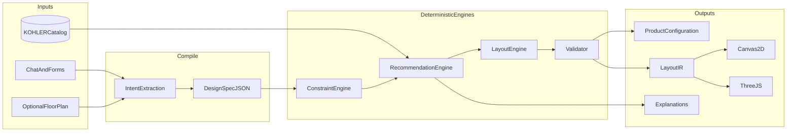
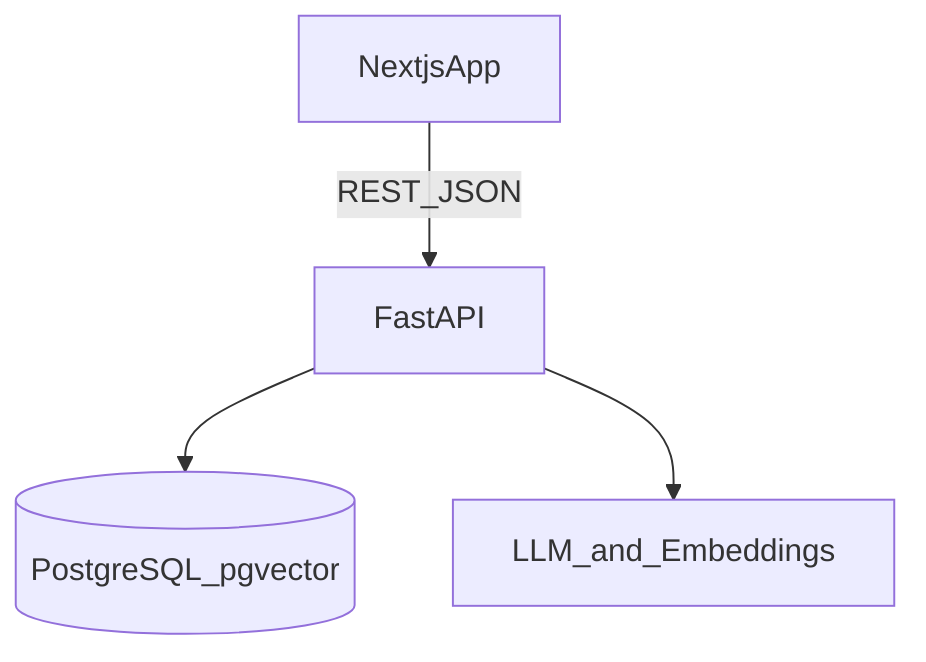
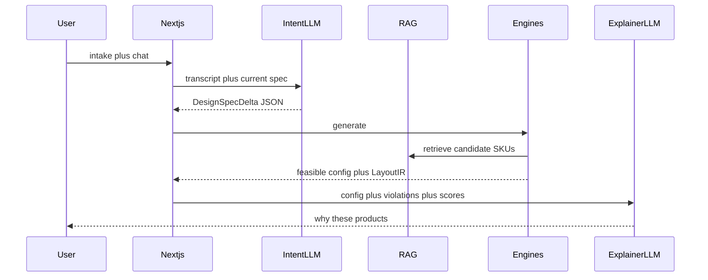

# KOHLER AI Bathroom Designer & Planner — Architecture

## Evaluation-first design thesis

Judges will score **approach (45%)** more than polish. The core innovation is treating bathroom design as a **Design Compiler**:

1. Natural language + form inputs compile into a structured **Design Spec**.
2. A **Constraint Solver** enforces hard physics/catalog/budget rules.
3. A **Scorer** ranks feasible configurations against soft preferences (style, features, sustainability, space efficiency).
4. One **Layout IR** (intermediate representation) drives 2D, later 3D, BOM, and explanations.

AI never invents SKUs or dimensions. The catalog is the source of truth. This is demoable, testable, and distinct from “ChatGPT that dumps product lists.”



---

## System architecture

**Frontend:** Next.js App Router + React + TypeScript + Tailwind. Conversational planner, 2D canvas, later React Three Fiber.

**Backend:** FastAPI (Python) as the engine host (constraints, geometry, RAG, LLM orchestration). Next.js only for UI, BFF-light, and static assets.

**Data:** PostgreSQL for users/sessions/designs/catalog. `pgvector` on `product_embeddings` for RAG over KOHLER specs, install notes, and compatibility text.

**AI:** LLM API (OpenAI/Anthropic/Gemini — swap via adapter). Structured outputs only (`pydantic` / JSON schema). Vision model optional for floor-plan extraction, always human-confirmed.

**3D:** Three.js via React Three Fiber consuming the same Layout IR as 2D. No second layout source.

**Repo:** GitHub monorepo.

Hackathon hosting: Vercel (web) + Railway/Render (API + Postgres). Local Docker Compose for the team.



**Hard vs soft (non-negotiable split)**

| Layer | Owns | May not |
|---|---|---|
| Intent LLM | Parse prefs, rooms, products, budget language | Pick SKUs, invent sizes |
| Constraint engine | Room bounds, fixture size, clearances, budget, compatibility, install | Optimize aesthetics |
| Recommendation | Rank feasible SKUs by soft scores + KOHLER mix | Override hard fails |
| Layout engine | Place fixtures, walls, doors, plumbing snaps | Ignore collisions |
| Validator | Final pass / reject / repair | Trust LLM geometry |

---

## Folder structure

```text
/
  apps/
    web/                          # Next.js
      app/
        page.tsx                  # landing
        planner/page.tsx          # main workspace
        design/[id]/page.tsx
      components/
        chat/
        intake/                   # dimensions, budget, products
        canvas2d/
        canvas3d/                 # R3F, feature-flagged
        catalog/
        results/                  # BOM, scores, explanations
      lib/api.ts
    api/                          # FastAPI
      app/main.py
      app/routers/
        designs.py
        catalog.py
        chat.py
        layout.py
      app/engines/
        constraints/
        recommend/
        layout/
        validate/
      app/ai/
        intent.py
        rag.py
        modify.py
        prompts/
      app/models/                 # SQLAlchemy / SQLModel
      app/schemas/                # Pydantic contracts
      app/seed/                   # curated KOHLER catalog JSON
  packages/
    shared-types/                 # optional TS types generated from OpenAPI
  docker-compose.yml
  README.md
```

Keep engines as pure Python modules with no FastAPI imports so they unit-test without HTTP.

---

## Database schema

Core tables (Postgres):

**`products`** — KOHLER source of truth  
`id`, `sku`, `name`, `category` (`toilet|lavatory|faucet|shower|bath|storage|lighting|accessory|vanity`), `family`, `collection`, `width_mm`, `depth_mm`, `height_mm`, `price_inr` (or USD; one currency field + `currency`), `install_type` (`floor|wall|recessed`), `water_use` (Lpf/gpm), `finish`, `style_tags[]`, `sustainability_score` (0–100), `requires_supply`, `requires_drain`, `clearance_overrides jsonb`, `image_url`, `spec_url`, `is_active`

**`product_compat`** — directed/undirected pairs  
`product_id`, `other_id`, `relation` (`requires|incompatible|finish_match|rough_in_match`), `notes`

**`product_embeddings`**  
`product_id`, `embedding vector`, `chunk` (name+spec+install+features)

**`designs`**  
`id`, `session_id`, `title`, `status` (`draft|feasible|failed|modified`), `budget_cents`, `currency`, `room jsonb` (see Layout IR), `spec jsonb` (Design Spec), `layout_ir jsonb`, `scores jsonb`, `explanation jsonb`, `created_at`

**`design_items`**  
`design_id`, `product_id`, `role` (`primary_toilet|vanity|faucet|...`), `qty`, `unit_price`, `placement_id`

**`messages`**  
`design_id`, `role`, `content`, `extracted_delta jsonb`

**`constraint_profiles`**  
`id` (`nkba_std`, `compact_apt`), `rules jsonb` (min clearances, door swing, etc.)

Indexes: `products(category)`, GIN on `style_tags`, IVF/HNSW on embeddings, `designs(session_id)`.

Seed 40–80 real-ish KOHLER SKUs across toilets, vanities/lavs, faucets, showers, baths, storage — enough for combinatorial demos, not a full PIM.

---

## API contracts

Version `/api/v1`. JSON only. Every mutating design call returns `{ spec, layout_ir, items, totals, hard_violations[], soft_scores, explanation }`.

| Method | Path | Purpose |
|---|---|---|
| GET | `/catalog/products` | Filter by category, price, tags, dims |
| GET | `/catalog/products/{sku}` | Full spec + compat |
| POST | `/catalog/search` | Hybrid keyword + vector RAG |
| POST | `/designs` | Create design from intake form |
| GET | `/designs/{id}` | Load design |
| PATCH | `/designs/{id}/spec` | Structured spec update (no LLM) |
| POST | `/designs/{id}/chat` | NL modify → intent delta → re-solve |
| POST | `/designs/{id}/generate` | Run constraint + reco + layout |
| POST | `/designs/{id}/validate` | Re-validate current IR |
| POST | `/vision/floorplan` | Optional: image → proposed room polygon (untrusted) |
| GET | `/health` | Liveness |

**Design Spec (canonical)** — produced by forms + intent LLM:

```text
room: { width_mm, depth_mm, height_mm, doors[], windows[], wet_wall_hint }
budget: { max, currency, flexibility: none }
hard_required: categories[] / sku locks
preferences: { styles[], features[], sustainability_weight, space_efficiency_weight }
constraints_profile: "nkba_std" | "compact_apt"
```

OpenAPI generated from Pydantic = technical execution points.

---

## AI workflow



**Three LLM jobs only**

1. **Intent extraction** — map utterance to `DesignSpecDelta` (strict schema, temperature ~0). Reject unknown fields.
2. **Catalog RAG** — embed query; retrieve top-k products/chunks; engines filter by hard constraints *before* ranking. LLM may *describe* products, never add SKUs not in retrieve+filter set.
3. **Conversational modify + explain** — “swap to wall-hung toilet”, “warmer lighting”, “cut 15% cost”. Delta → engines → if infeasible, return structured failures + 2 alternatives. Explainer writes user-facing rationale from engine traces (no new facts).

**Vision (optional, phase 2):** floor-plan image → bounding box + door candidates. User confirms dimensions in UI. Never auto-trust pixels for hard constraints.

Guardrails: max tokens, JSON schema validation, SKU allowlist, budget checksum in validator.

---

## Constraint model

Represent as a CSP over variables:

- **Variables:** product choice per slot (toilet, lavatory, faucet, shower, bath optional, storage optional), pose `(x, y, rotation)` on a 2D grid (10–25 mm).
- **Hard constraints (must satisfy or fail):**
  - Room AABB / polygon containment
  - Fixture footprint + door/drawer swing
  - Clearances: toilet front 600–760 mm, side 400+ mm; vanity knee/approach; shower interior; door not blocked (profile-driven)
  - Wet-wall / plumbing: drains only on wet walls unless `install_type` allows
  - Compatibility: faucet↔lavatory hole count; toilet rough-in; shower valve↔trim
  - Budget: `sum(price) <= budget`
  - Unique slots: one primary toilet, etc.
- **Soft (scored, never block if hard-feasible):**
  - Style embedding / tag overlap
  - Feature coverage (rain shower, storage, accessibility)
  - Sustainability (water use, `sustainability_score`)
  - Space efficiency (circulation area / leftover)
  - Collection coherence (same KOHLER family bonus)
  - Price headroom (avoid maxing budget with no benefit)

Solver strategy for hackathon (feasible > optimal):

1. Filter catalog per slot by size, category, install, price band.
2. Compatibility graph prune.
3. Greedy + bounded backtracking on slots (order: toilet → shower/bath → vanity → faucet → storage).
4. For each SKU set, run layout placement heuristics; reject if geometry fails.
5. Rank remaining by weighted soft score.

If zero feasible: return **minimal violating constraints** (e.g. “budget 8% over if rain shower required”) and repair suggestions.

---

## Recommendation algorithm

```text
candidates = rag ∪ category_filters(spec)
feasible = constrain(candidates, spec.hard)
score(itemset) =
    w_style * style_match
  + w_feat * feature_coverage
  + w_sust * normalized_sustainability
  + w_space * circulation_ratio
  + w_family * collection_coherence
  - w_waste * unused_budget_penalty_if_quality_tied
return top_3 itemsets + traces
```

Weights come from the spec (user sliders / inferred prefs). Default: style 0.3, features 0.25, sustainability 0.2, space 0.15, family 0.1.

Always return **why**: matched tags, water savings vs baseline, clearance margins.

Business/sustainability story: water-efficient KOHLER SKUs as first-class score, not a badge.

---

## Layout representation (IR)

Single JSON document stored on `designs.layout_ir`:

```text
units: mm
room: { polygon, height_mm, doors[{id, wall, offset, width, swing}], windows[] }
wet_walls: [wall_id]
grid_mm: 25
objects: [{
  id, sku, category, role,
  origin: {x, y}, rotation_deg,
  bbox: {w, d, h},
  clearances: [{type, polygon}],
  connections: [{kind: drain|supply, wall_id}]
}]
circulation: polygon
meta: { profile, solver_version, seed }
```

2D renderer draws polygons + clearance ghosts. 3D maps each object to a glTF/primitive box with `bbox` and `sku` material. If a mesh is missing, render dimensionally accurate boxes (honest MVP).

---

## 2D / 3D rendering architecture

**2D (MVP must-have):** HTML Canvas or SVG in `components/canvas2d`. Camera: pan/zoom. Layers: walls, wet wall hatch, fixtures, clearance, doors, dimension labels. Click object → catalog card. This is the feasibility proof for judges.

**3D (phase 2, feature flag `ENABLE_3D`):** `@react-three/fiber` + `@react-three/drei`. Scene graph generated from Layout IR only. OrbitControls, simple PBR materials by finish tag, optional room box + tiled floor. No physics engine.

**Sync rule:** any chat modification regenerates IR on the server; clients are read-only views. Prevents 2D/3D drift.

---

## Frontend component structure

Planner workspace (one page, high UX score):

- `IntakePanel` — W, D, H, budget, required products, style chips, sustainability slider
- `ChatDock` — modifications + explanations
- `CanvasStage` — 2D default, 3D toggle when IR valid
- `ConfigurationRail` — BOM, running total vs budget bar, hard/soft badges
- `IssueList` — hard violations in red; soft misses as suggestions
- `ProductDrawer` — catalog facts from API, not LLM prose

UX principle: **show the spec the AI extracted** as editable chips so users can correct the compiler. That is trust and feasibility.

---

## Development phases (hackathon)

**Phase 0 — hours 0–2:** monorepo, Docker Postgres, seed catalog, OpenAPI stub, empty planner shell.

**Phase 1 — Approach demo (hours 2–8):** Design Spec schema, constraint engine + tests, generate endpoint, 2D canvas from IR, budget bar. *This wins Approach + Execution even without pretty 3D.*

**Phase 2 — AI loop (hours 8–14):** intent extraction, RAG search, chat modify, explainer, issue list.

**Phase 3 — Reco quality (hours 14–18):** compatibility graph, top-3 alternatives, sustainability scoring, compact vs NKBA profiles.

**Phase 4 — 3D + vision (hours 18–22):** R3F boxes-from-IR, optional floor-plan confirm flow.

**Phase 5 — Judge polish (last 2–4h):** one scripted demo path (small Indian apartment, tight budget, eco preference, then “add rain shower” infeasible → repair), README architecture diagram, seed data completeness.

Cut order if time-crunched: vision → fancy meshes → user accounts → 3D. Never cut validator or 2D.

---

## Testing strategy

| Layer | How |
|---|---|
| Constraint unit tests | Golden rooms: 1500×2000 fail double vanity; 2400×2700 pass toilet+shower+lav; budget cliff |
| Compatibility | Faucet 8" spread vs single-hole lav must fail |
| Layout | Overlap, door swing, out-of-room, wet-wall drain |
| Intent | Fixture JSON snapshots for 15 utterances |
| API | pytest + httpx; generate → validate round-trip |
| Frontend | Playwright: intake → generate → BOM total ≤ budget |
| RAG | Retrieved SKUs ⊆ catalog; no hallucinated SKU in items |
| Regression | `solver_version` + frozen seed in CI |

Property: **no accepted design with `hard_violations.length > 0`.**

---

## Risks and failure cases

| Risk | Failure mode | Mitigation |
|---|---|---|
| LLM invents SKUs | Fake products | Allowlist join to `products`; drop others |
| LLM invents mm | Unbuildable layout | Ignore LLM numbers; only form/vision-confirmed room |
| Empty feasible set | Dead demo | Repair engine + “relax rain shower / raise budget / compact profile” |
| Catalog too thin | Reco looks fake | Seed coverage matrix before coding UI |
| Over-3D | No working layout | 2D-first; boxes in 3D |
| Clearance standards debate | Judges nitpick | Named profiles + show margins on canvas |
| Latency | Chat feels broken | Stream intent; run engines server-side; cache embeddings |
| Currency/price | Budget nonsense | Single currency in seed; integer cents |
| Image pipeline | Bad dimensions | Confirm UI; never hard-constrain from unconfirmed vision |
| Scope creep | Unfinished | Phase cut list above |

---

## What this architecture is optimizing in scoring

- **45% Approach:** Design Compiler, hard/soft split, explainable traces, repair-on-infeasible, sustainability as an objective.
- **25% Execution:** typed contracts, engine isolation, tests, catalog as DB truth, one Layout IR.
- **20% UX:** one workspace, editable extracted spec, 2D that looks like a plan, budget always visible, chat that mutates a real layout.
- **10% Business:** KOHLER attach via collections/compat, water-use scoring, budget-feasible BOMs a dealer could quote.

Out of scope for MVP: full BIM, photoreal materials, multi-user auth, live KOHLER PIM sync, automatic MEP drawings.
